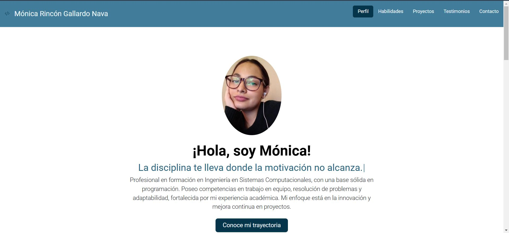

## Portafolio de Proyectos

¡Hola! **Soy Mónica Rincón Gallardo Nava** 🌙 recién egresada de la carrera de Ingeniería en Sistemas Computacionales con un gran interés en el diseño y experiencia de usuario, aquí encontrarás información sobre mí 💌.

---

#### El proyecto cuenta con las secciones de:

- Habilidades
- Proyectos
- Testimonios
- Contacto

#### Creado con:

#### Vista Previa:
